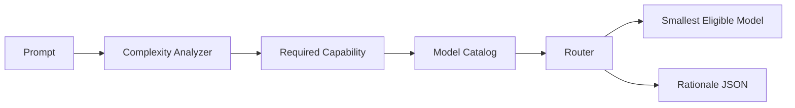

# carbon-model-router

Route prompts to the **smallest capable LLM** — cut cost and carbon without
sacrificing quality on hard tasks.

Over-modeling is real: sending "thanks!" to a frontier model burns money and
energy for nothing. This tool scores prompt complexity with deterministic
heuristics, then picks the cheapest/lowest-energy model that still clears a
capability and confidence bar. No live API calls.

## Features

- **Model catalog** — cost/1k, energy kWh/1k, capability (0–1), max tokens
- **Complexity analyzer** — length, code fences, math, multi-step markers, domain keywords
- **Router** — smallest model whose capability ≥ required and confidence ≥ threshold
- **Carbon mode** — prefer lowest energy among eligible models
- **CLI** — `cmr route`, `cmr catalog`, `cmr analyze`
- **Deterministic** — same prompt always routes to the same model
- **Zero runtime deps** — Python 3.11+ stdlib only

## Architecture



## Install

```bash
pip install -e ".[dev]"
```

## Quick start

```bash
# Route a prompt
cmr route "What is the capital of France?"

# Hard prompt → larger model
cmr route "$(cat design_brief.md)"

# JSON decision for pipelines
cmr route "Summarize this ticket" --json

# Prefer lowest-carbon eligible model
cmr route "Draft a commit message" --carbon

# Force the prompt domain when you already know it
cmr route "def quicksort(arr):" --domain code
cmr route "Prove the intermediate value theorem" --domain math
cmr route "Hey, can you reword this?" --domain chat

# List the catalog
cmr catalog

# Inspect complexity signals without routing
cmr analyze "Implement Raft leader election with formal proofs" --json
```

## Example output

```
carbon-model-router decision
========================================
model:       small-8b  (Small 8B Instruct, local)
capability:  0.45
confidence:  0.85
complexity:  0.08  (required capability 0.29)
tokens:      ~9
est cost:    $0.000000
est energy:  0.000000 kWh

rationale:   complexity=0.08; required_capability=0.29; chose small-8b ...
```

## How routing works

1. **Analyze** the prompt into a complexity score (0–1) from weighted signals.
2. **Map** complexity → required capability (piecewise linear).
3. **Filter** catalog models that meet capability, confidence threshold, and context window.
4. **Select** the smallest eligible model (lowest capability, then cost). With `--carbon`, lowest energy first.

Confidence starts at 0.5 when a model exactly meets required capability and
rises toward 1.0 with surplus. The default threshold (0.70) therefore prefers
a small safety margin over the bare minimum.

### Domain override

Heuristics can miss short-but-hard prompts. When you already know the domain,
force it:

| `--domain` | Effect |
|------------|--------|
| `code` | Floor the code signal at 0.55 so code tasks are not under-routed |
| `math` | Floor the math signal at 0.55 |
| `chat` | Soft-cap complexity at 0.35 unless code/math signals dominate |

```bash
cmr route "fix this off-by-one" --domain code
cmr analyze "short lemma about continuity" --domain math --json
```

Omit `--domain` to keep auto-detection.

## Built-in catalog (illustrative)

| id | capability | $/1k | kWh/1k | max tokens |
|----|------------|------|--------|------------|
| nano-classifier | 0.25 | 0 | 0.00001 | 512 |
| small-8b | 0.45 | 0.00005 | 0.00008 | 4096 |
| medium-32b | 0.65 | 0.0004 | 0.00035 | 8192 |
| large-70b | 0.80 | 0.0012 | 0.0009 | 16384 |
| frontier-x | 0.97 | 0.015 | 0.0045 | 128000 |

Numbers are order-of-magnitude demos, not live pricing. Supply your own via
`--catalog models.json`:

```json
{
  "models": [
    {
      "id": "my-small",
      "name": "My Small",
      "provider": "local",
      "cost_per_1k": 0.0001,
      "energy_kwh_per_1k": 0.0002,
      "capability": 0.5,
      "max_tokens": 8192
    }
  ]
}
```

## Python API

```python
from carbon_model_router import analyze_prompt, route_prompt, default_catalog

score = analyze_prompt("Design a consensus protocol and prove safety")
print(score.score, score.required_capability)

decision = route_prompt(
    "Design a consensus protocol and prove safety",
    default_catalog(),
    carbon_weighted=True,
)
print(decision.model.id, decision.rationale)
```

## Development

```bash
pip install -e ".[dev]"
pytest
pytest --cov=carbon_model_router
```

## License

MIT — see [LICENSE](LICENSE).
